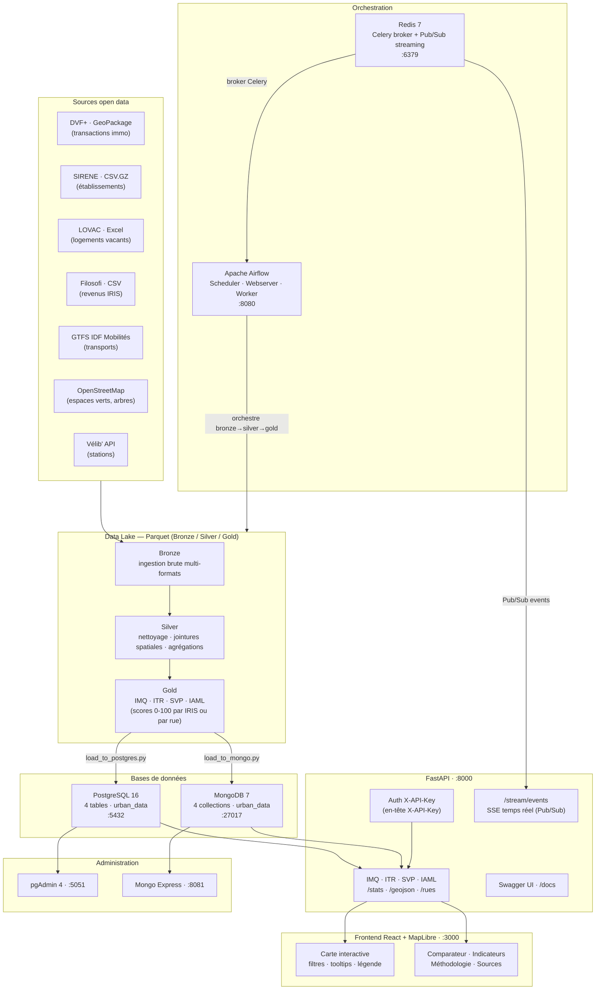

# Urban Data Explorer · Paris

Plateforme d'analyse et de visualisation des dynamiques du logement à Paris.  
4 indicateurs composites calculés à l'échelle IRIS ou rue sur les données open data parisiennes.

---

## Architecture globale



---

## Indicateurs

| Indicateur | Granularité | Sources | Volume |
|---|---|---|---|
| **IMQ** — Indice de Mutation de Quartier | IRIS | DVF+, SIRENE, Filosofi, LOVAC | 992 IRIS |
| **ITR** — Indice de Tension Résidentielle | Rue | DVF+ | 1 254 rues |
| **SVP** — Score de Verdure et Proximité | Rue | OSM (parcs, arbres) | 1 254 rues |
| **IAML** — Accessibilité Multimodale au Logement | Rue | GTFS, Vélib', OSM | 1 329 rues |

---

## Stack technique

| Composant | Technologie |
|---|---|
| Pipeline ETL | Python · Pandas · GeoPandas · Parquet |
| Orchestration | Apache Airflow 2 · Celery · Redis |
| Base relationnelle | PostgreSQL 16 |
| Base documentaire | MongoDB 7 |
| API | FastAPI · Uvicorn · Auth API Key |
| Streaming | Redis Pub/Sub · SSE (Server-Sent Events) |
| Frontend | React 18 · MapLibre GL JS 4 · Vite |
| Infrastructure | Docker · Docker Compose |

---

## Prérequis

- Docker Desktop (Linux engine)
- Node.js 18+ (frontend local uniquement)

---

## Démarrage

### 1. Lancer tous les services

```bash
docker compose up -d --build
```

### 2. Première utilisation — préparer les géométries IRIS

```bash
python prepare_iris_geojson.py
```

Génère `data/raw/raw_IMQ/iris_paris.geojson` (992 IRIS parisiens, requis pour IMQ).

### 3. Lancer le pipeline complet

```bash
docker compose exec api python run_pipeline.py
```

Le pipeline s'exécute en Bronze → Silver → Gold → chargement PostgreSQL + MongoDB.  
Les étapes déjà calculées sont automatiquement ignorées (cache Parquet).

---

## Services et URLs

| Service | URL | Credentials |
|---|---|---|
| Frontend React | http://localhost:3000 | — |
| API FastAPI | http://localhost:8000 | `X-API-Key: urban-data-explorer-2026` |
| Swagger / docs | http://localhost:8000/docs | même clé via bouton Authorize |
| Airflow UI | http://localhost:8080 | admin / admin |
| pgAdmin | http://localhost:5051 | admin@local.com / admin |
| Mongo Express | http://localhost:8081 | admin / admin |

---

## API — Endpoints principaux

### Authentification
Tous les endpoints (sauf `/health`) requièrent l'en-tête :
```
X-API-Key: urban-data-explorer-2026
```

### Indicateurs
```
GET /imq/geojson   GET /imq/stats
GET /itr/geojson   GET /itr/stats    GET /itr/rues    GET /itr/rues/{nom_voie}
GET /svp/geojson   GET /svp/stats    GET /svp/rues
GET /iaml/geojson  GET /iaml/stats   GET /iaml/rues   GET /iaml/rues/{nom_voie}
```

### Streaming temps réel (Redis Pub/Sub)
```
GET  /stream/events    → flux SSE (Server-Sent Events)
GET  /stream/status    → état de la connexion Redis
POST /stream/publish   → publier un événement (test)
```

---

## Pipeline détaillé

```
data/raw/          → Bronze (ingestion, aucune transformation)
data/bronze/       → Silver (nettoyage, jointures spatiales, agrégations)
data/silver/       → Gold  (calcul des scores IMQ/ITR/SVP/IAML)
data/gold/         → PostgreSQL + MongoDB
```

Commandes par couche :
```bash
docker compose exec api python run_pipeline.py --bronze
docker compose exec api python run_pipeline.py --silver
docker compose exec api python run_pipeline.py --gold
docker compose exec api python run_pipeline.py --load-db
docker compose exec api python run_pipeline.py --indicateur ITR
```

### Metriques de performance

Affiche un tableau comparatif des temps d'exécution par tâche sur les N derniers runs :

```bash
docker compose exec api python pipeline_metrics.py --runs 3
```

---

## Vérification des bases de données

### PostgreSQL
```bash
docker compose exec api python -c "
from sqlalchemy import create_engine, text, inspect
import os
eng = create_engine(os.environ['DATABASE_URL'])
with eng.connect() as c:
    for t in inspect(eng).get_table_names():
        print(t, c.execute(text(f'SELECT COUNT(*) FROM {t}')).scalar())
"
```

### MongoDB
```bash
docker exec urban_data_explorer_mongo mongosh -u urban_mongo_admin -p urban_mongo_pass \
  --authenticationDatabase admin \
  --eval "db=db.getSiblingDB('urban_data'); db.getCollectionNames().forEach(c=>print(c,db[c].countDocuments()))"
```

---

## Arrêt

```bash
docker compose down
```


```text
urban_data_explorer/
   api/                # FastAPI
   frontend/           # React + Vite
   src/                # Pipelines bronze/silver/gold par indicateur
   data/               # Donnees raw/bronze/silver/gold
   run_pipeline.py     # Orchestrateur du pipeline
   Dockerfile
   Docker-compose.yml
```

## Prerequis

- Docker + Docker Compose
- Node.js 18+ (pour lancer le frontend en local)

## Demarrage simple

### Première utilisation : Préparation des données géométriques IRIS

Avant de lancer l'API pour la première fois, vous devez extraire la géométrie des IRIS depuis l'archive IGN :

```bash
python prepare_iris_geojson.py
```

Cela génère le fichier `data/raw/raw_IMQ/iris_paris.geojson` (1.9 MB) contenant les 992 IRIS de Paris, nécessaire pour charger l'API IMQ.

### Lancement

1. Lancer tous les services

```bash
docker compose up -d --build
```

2. Verifier les services

```bash
docker compose ps
```

3. Lancer la couche gold (alimente PostgreSQL et MongoDB)

```bash
docker compose exec -T api python run_pipeline.py --gold
```

## Services et URLs

- API FastAPI : http://localhost:8000
- Documentation API : http://localhost:8000/docs
- Frontend (dev local) : http://localhost:5173
- pgAdmin : http://localhost:5051
- Mongo Express : http://localhost:8081

## Base de donnees

### PostgreSQL

- Service Docker : `db`
- Base : `urban_data`
- Tables chargees par le gold :
   - `itr_par_rue`
   - `iaml_par_rue`

Verification rapide :

```bash
docker compose exec -T db psql -U urban_user -d urban_data -c "\\dt"
docker compose exec -T db psql -U urban_user -d urban_data -c "SELECT 'itr_par_rue' AS table_name, COUNT(*) FROM itr_par_rue UNION ALL SELECT 'iaml_par_rue', COUNT(*) FROM iaml_par_rue;"
```

### MongoDB

- Service Docker : `mongo`
- Base : `urban_data`
- Collections chargees par le gold :
   - `itr_par_rue`
   - `iaml_par_rue`

Verification rapide :

```bash
docker compose exec -T mongo mongosh -u urban_mongo_admin -p urban_mongo_pass --authenticationDatabase admin --eval "db = db.getSiblingDB('urban_data'); print('collections=' + db.getCollectionNames().join(',')); print('itr_count=' + db.itr_par_rue.countDocuments({})); print('iaml_count=' + db.iaml_par_rue.countDocuments({}));"
```

## API principale

### ITR

- `GET /stats`
- `GET /rues`
- `GET /rues/{nom_voie}`
- `GET /geojson`

### IAML

- `GET /iaml/stats`
- `GET /iaml/rues`
- `GET /iaml/rues/{nom_voie}`
- `GET /iaml/geojson`

## Frontend (local)

```bash
cd frontend
npm install
npm run dev
```

## Arret des services

```bash
docker compose down
```

## Notes

- Le pipeline est organise par couches : bronze, silver, gold.
- Chaque indicateur a ses propres dossiers sous `src/` et `data/`.
- Les commandes rapides sont aussi disponibles dans `COMMANDES.md`.